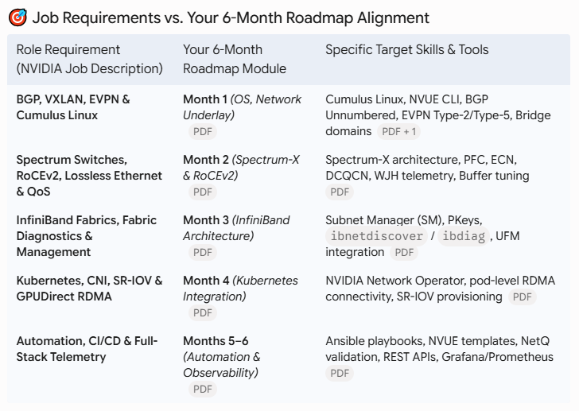

# 🚀 NVIDIA AI Networking Master Plan & Lab Repository

Welcome to the **`nvidia-ai-networking-labs`** repository! This project serves as a practical, hands-on portfolio backing the **6-Month NCP-AIN Professional Learning Path** and preparing for high-impact roles (e.g., *Senior Solutions Architect, InfiniBand & Ethernet*).

---

## Execution Rules & Principles

* Every lab configuration, live deployment (`nv config apply`), or state validation must be completed cleanly.
* **Muscle Memory First**: Commands must be manually typed via NVUE CLI or written into configuration snippets to build real-time CLI fluency.
* **Post-Design Verification**: Every lab section requires a explicit configuration export (`nv show config` / `frr.conf`) and state proof before being marked complete.

---

## 📅 Master 6-Month Curriculum & Lab Structure

### 📍 Month 1: OS, Network Underlay & BGP Foundation (`/labs/01-bgp-unnumbered`)
* **Week 1**: NVUE CLI basics, switch initialization, system parameters (`nv set system hostname`), interface provisioning[cite: 1, 2].
* **Week 2**: BGP Unnumbered basics, IPv6 Link-Local peering, Autonomous System (AS) assignment, peer-groups[cite: 1, 2].
* **Week 3**: Underlay routing, ECMP hashing, FRR verification (`vtysh -c "show ip bgp summary"`), route maps[cite: 1, 2].
* **Week 4**: Layer 2 redundancy & overlay readiness — MLAG, EVPN Type-2/Type-5, VXLAN VNIs[cite: 1, 2].

### ⚡ Month 2: Spectrum-X, RoCEv2 & Lossless Ethernet (`/labs/04-rocev2-qos-spectrum`)
* PFC (Priority Flow Control), ECN (Explicit Congestion Notification), DCQCN tuning.
* Spectrum Switch buffer tuning & What-Just-Happened (WJH) telemetry[cite: 2].

### ⚛️ Month 3: InfiniBand Architecture & Fabric Management (`/labs/05-infiniband-fabric`)
* Subnet Manager (SM) administration, PKeys allocation, `ibnetdiscover` / `ibdiagnet` diagnostic tools[cite: 2].
* NVIDIA UFM (Unified Fabric Manager) deployment & monitoring[cite: 2].

### ☸️ Month 4: Kubernetes Integration & Container Orchestration (`/labs/06-k8s-sriov-rdma`)
* NVIDIA Network Operator deployment, SR-IOV plugin setup[cite: 2].
* GPUDirect RDMA pod-level network attachment & verification[cite: 2].

### 🤖 Months 5–6: Automation, Observability & Cluster Review (`/labs/07-ansible-netq-automation`)
* Ansible playbooks for NVUE automation, declarative state management[cite: 1, 2].
* NetQ fabric validation, REST API integrations, Prometheus/Grafana dashboards[cite: 2].

---

## 📂 Repository Directory Layout

```text
nvidia-ai-networking-labs/
├── README.md                           <-- Master Study & Execution Dashboard
└── labs/
    ├── 01-bgp-unnumbered/              <-- Month 1 Focus (Underlay & BGP Unnumbered)
    │   ├── README.md
    │   ├── topology.png
    │   └── configs/
    ├── 02-mlag-dual-homing/             <-- Month 1 (L2 Redundancy)
    ├── 03-evpn-vxlan-overlay/           <-- Month 1 (Overlay Fabrics)
    ├── 04-rocev2-qos-spectrum/          <-- Month 2 (Spectrum-X / Lossless Ethernet)
    ├── 05-infiniband-fabric/            <-- Month 3 (InfiniBand & SM)
    ├── 06-k8s-sriov-rdma/               <-- Month 4 (Kubernetes & RDMA)
    └── 07-ansible-netq-automation/     <-- Months 5–6 (Automation & Observability)