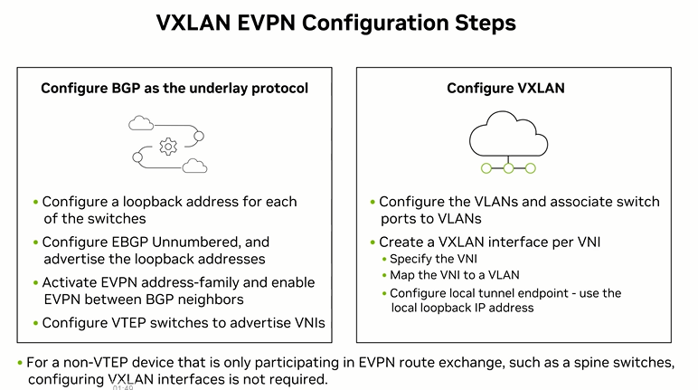

# 🧪 Lab 03: EVPN-VXLAN Overlay Fabrics

## 🎯 Objectives
- Configure VXLAN Tunnel End Points (VTEPs) and VNIs via NVUE.
- Deploy BGP EVPN control plane for Type-2 (MAC/IP) and Type-5 (IP Prefix) routes.
- Validate multi-tenant Layer 2/Layer 3 overlay connectivity across the underlay.

*8-Step structure for configuring EVPN - VxLAN - it's the right one for hands-on config work*
Step 1 — Loopback and interfaces
Step 2 — Underlay BGP
Step 3 — EVPN + l2vpn-evpn AFI ⚠️ (the line that was missing on leaf02)
Step 4 — VXLAN tunnel endpoint (NVE)
Step 5 — VLAN-to-VNI mapping and access ports
Step 6 — SVIs with anycast gateway
Step 7 — L3VNI + VRF-to-EVPN route leaking
Step 8 — Data plane test

# Mastery Plan of EVPN VXLAN
*Centralised, Symetric and Asymetric routing*
Muscle memory on the baseline symmetric IRB config (what you've been building) needs to be automatic before layering complexity on top, because every one of those advanced scenarios is a variation on this same skeleton, not a different skeleton entirely.

How your 8 steps map onto what's coming next, so you know what stays fixed vs. what changes:

*Steps 1-5 (loopback, underlay BGP, EVPN AFI, NVE, VLAN-to-VNI)* - these stay essentially identical across centralized, distributed asymmetric, and multihoming. This is your fabric foundation; you're not re-learning it each time, just reusing it.

*Step 6-7 (SVI/anycast gateway, L3VNI/route leaking)* - this is where the routing-type variations actually live:
Distributed symmetric IRB (what you just typed) - every leaf has the SVI + L3VNI, routes locally, symmetric on both ingress/egress leaf

*Centralized routing* - only a subset of devices (often border leaves/spines) hold the L3VNI/SVI; other leaves only bridge (L2VNI only, no local SVI) and rely on the centralized routers for inter-subnet traffic - so Step 6 gets removed from most leaves, kept only on the centralized nodes

*Distributed asymmetric IRB* - routes locally on ingress but uses a shared "transit VNI" instead of requiring the L3VNI on the egress leaf too - subtle but real difference in Step 7's route-target/VNI handling
Multihoming (EVPN Type-1/ESI) - adds an entirely new step between 5 and 6 - Ethernet Segment Identifier config on bonds/MLAG-equivalent interfaces, so dual-homed hosts get active-active forwarding without the classic MLAG peer-link - this is genuinely new config, not a variation of existing steps

*Practical suggestion for your repetition practice:* once Steps 1-5 are fully automatic (no hesitation, no lookup), start doing side-by-side reps - build the same 2-leaf/1-spine topology twice in a row, once as symmetric (what you have), once immediately after ripping out Step 6 from one leaf to simulate centralized routing. That contrast drills the conceptual difference faster than repeating the identical symmetric config in isolation.

Also worth having in your back pocket for validation once you get to multihoming:

nv show evpn esi
sudo vtysh -c "show evpn es"
sudo vtysh -c "show bgp evpn route type es"

Type-1 (Ethernet Segment) and Type-4 (ES route) EVPN routes are the ones you'll be reading for that scenario, distinct from the Type-2/Type-3 you've been using so far.
